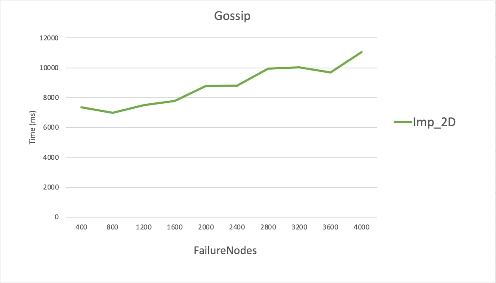

# Bonus Project Report

# Team Members:
This project is completed by Smridhi Bhat, UFID: 26010147 and Anuj Singh Koli, UFID: 97977572 

COP5615: Project 2 bonus code

# Build Process:

1. Download the zip file Project2.zip and unzip the folder.
2. Open command prompt or terminal, give command dotnet fsi Project2_bonus.fsx numberOfNodes topology algorithm failureNodes. 
In numberOfNodes, you can give the number of nodes(a positive integer value) for which the algorithm should run with. In topology you can give [line, full, 3D, Imp3D, 2D, Imp2D] and in algorithm, you can give [gossip, push-sum] and in failureNodes, you can give the number of nodes (a positive integer value) that needs to be failed.

# Working of the Bonus code:

In the bonus code, we have implemented a Failure model that takes FailureNodes as the input parameter and then some random nodes are made failure nodes that do not transmit the message further in the network.

We observed that the network failed to converge in the push sum algorithm after executing the failure model as the failure nodes did not transmit the transmit the information to its neighbors.

To deal with this issue, we implemented a ActorConverger function whose job is to send the message to the failure nodes that were unable to transmit the message so that the convergence will go up. 

We experimented with the failure model by taking Full, Imp_3D, 3D, Imp_2D, 2D, line topologies and gossip, push_sum algorithms for 5000 nodes and we plotted graphs based on the results as follows:

# Push-sum 
## Line

## Full

## 3D

## Imp3D

## 2D

## Imp2D

# Gossip
## Line

## Full

## 3D

## Imp3D

## 2D

## Imp2D

# Interesting observation

We observed that the network becomes highly unpredictable with an increase of failure nodes. The convergence speed keeps on fluctuating with alternating high and low values. 

