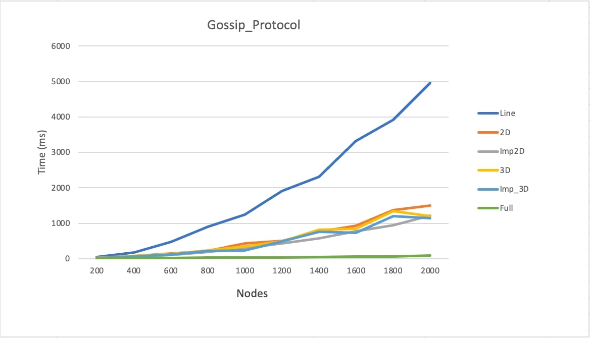
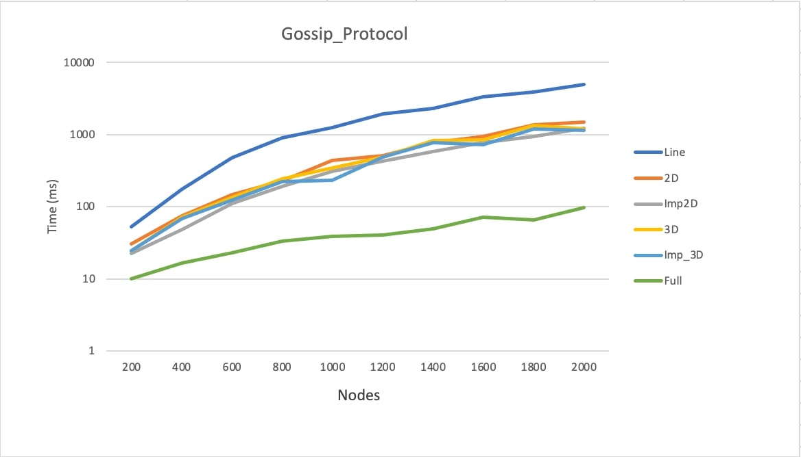
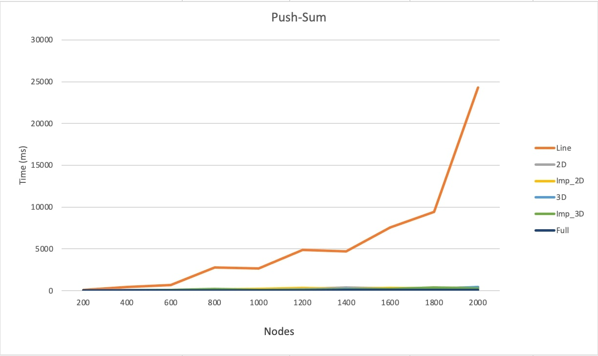
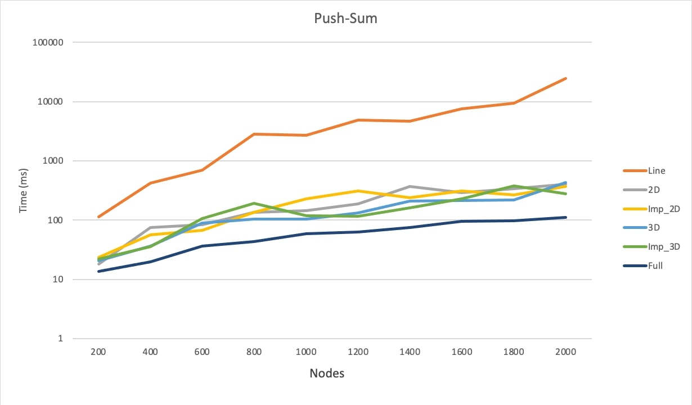
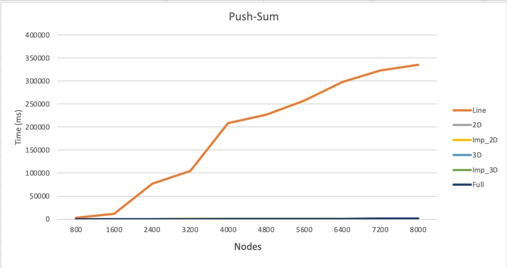
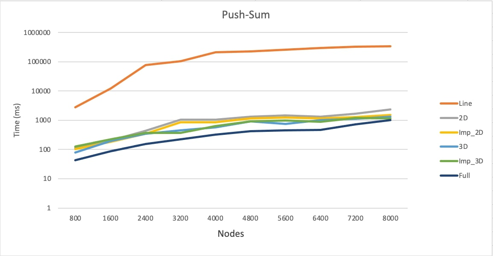

# Gossip Protocol

# Team Members:
This project is completed by Smridhi Bhat and Anuj Singh Koli

COP5615: Project 2

# Build Process:

1. Download the zip file Project2.zip and unzip the folder.
2. Open command prompt or terminal, give command dotnet fsi Project2.fsx numberOfNodes topology algorithm. 
In numberOfNodes, you can give the number of nodes(a positive integer value) for which the algorithm should run with. In topology you can give [line, full, 3D, Imp3D, 2D, Imp2D] and in algorithm, you can give [gossip, push-sum]

# Working:
We implemented Gossip and push_sum algorithms with line, full, 2D, Imp_2D, 3D, Imp_3D topologies as explained below:

## Gossip
In gossip protocol, a node transmits message(rumour) to its neighbors based on the topology used and further the nodes which receive this message transmits it to its neighbors and the process goes on. Here, a node is said to be converged when it hears the rumour 10 times and after convergence, the node stops transmitting the message. Once all nodes in the network are converged, the convergence time is printed out.

1. Full topology is the fastest to converge because it has access to all the nodes whereas line topology is the slowest one to converge as it has access to 2 neighbors only. 

2. 2D and Imp_2D have faster convergence than line topology, Imp_2D slightly better than 2D.

3. 3D and Imp_3D have faster convergence than 2D, Imp_2D but slower than full topology, again Imp_3D has slightly better convergence than 3D.

Convergence speed for different topologies with Gossip Protocol is in the following order:

Full > Imp_3D > 3D > Imp_2D > 2D > Line

### Linear Scale 2k

### Logarithmic Scale 2k

## Push-sum

We implemented push-sum algorithm by using two parameters s and w where s is set to the index of the actor and w = 1. In this algorithm, the convergence halts when an actor's s/w ratio remains the same for 3 consecutive times.

### Linear Scale 2k

### Logarithmic Scale 2k

# What is the largest network you managed to deal with for each type of topology and algorithm:

The largest network that we managed to implement is 8000 nodes for all the topologies and algorithms. Topologies like 3D, Imp3D, full, 2D, Imp2D could run for larger nodes but we decided to limit to 8k so that the results from different topologies could be comparable.

## Gossip 8k

### Linear Scale 8k

### Logarithmic Scale 8k

## Push-sum 8k

### Linear Scale 8k

### Logarithmic Scale 8k

# Interesting observations

- Line topology has the least convergence speed because it is connected to 2 neighbors only.
- Full topology has the fastest convergence speed for all the algorithms as it is connected to al the nodes in the network.
- 3D and Imp3D have better convergence speed than line but less than full topology.

